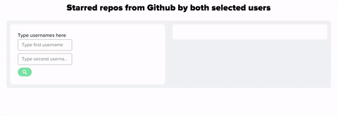

## Github stargazers
Simple app that finds starred repositories by group of users

### Notes:
- app uses no external libraries (no fireworks 🎆),
- tested only on chrome, as app uses native Promises and Fetch API,
- for simplicity, I'm killing github api, and request for 100 starred repos (not sure what is real limit on backend side) - no pagination implemented :<
- there's request limit in Github api (max 90), add authorization token to request to increase it
- you can test it here: vergilius.github.io/stargazers

### How does it look like?

